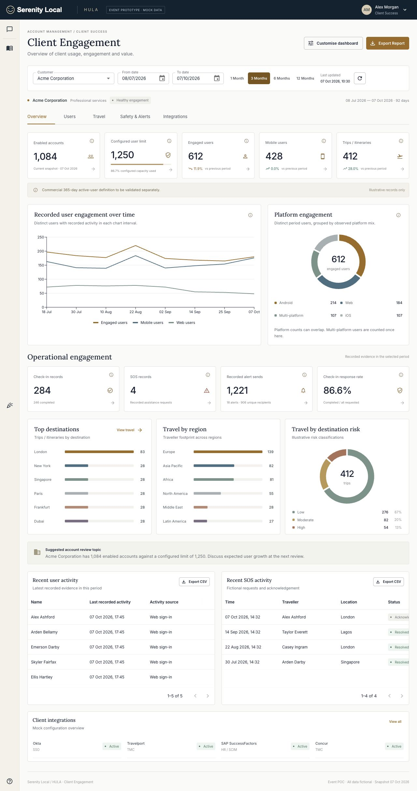

# AM Dashboard Prototype

Interactive client engagement and account-management dashboard concept, built with React, TypeScript, Vite and Material UI. **Serenity Local / HULA** is fictional branding. This project is intended solely as a UX/product prototype.

All customers, users, events, travel records, integrations and metrics are fictional. There is no backend, authentication or telemetry. No real APIs are called and no real customer information is included.

[Live demo](https://richardhanney.github.io/am-dashboard-poc/)



## Local setup

Requires Node 22.13+ or Node 24+ and npm; Node 24 is used for deployment.

```sh
npm ci
npm run dev
```

Open the local URL printed by Vite, normally `http://127.0.0.1:5173/`.

## Validation and production build

```sh
npm run lint
npm test
npm run build
npm run preview
```

The static output is in `dist/`. Preview is normally available at `http://127.0.0.1:4173/am-dashboard-poc/`. The production base defaults to `/am-dashboard-poc/` and can be configured with `PAGES_BASE_PATH`.

## Explore the prototype

The five tabs cover Overview, Users, Travel, Safety & Alerts and Integrations. Switch customers or dates, open metric receipt drawers, search/filter records and download CSV reports. Overview cards can be hidden or reordered, with layout preferences saved in browser localStorage. The sidebar celebration button fires local confetti; reduced-motion preferences are respected.

- **Acme Corporation:** healthy engagement, substantial travel and a configured user limit approaching capacity.
- **Globex International:** strong travel usage with lower recorded mobile adoption.
- **Northstar Energy:** lower engagement, more observed dormancy and greater illustrative higher-risk travel exposure.

The fixed fictional snapshot ends on 07 Oct 2026. Enabled accounts are a current snapshot, not a historical or commercial active-user measure. Engagement reflects recorded activity; mobile engagement is not proof of an installed app. Check-in response rate is completed / all requested, including pending and missed. Recorded alert sends do not establish delivery or reading. Commercial 365-day active-user criteria remain to be validated separately.

## GitHub Pages

The deployment workflow is **manual-only**. Pushing source does not deploy the site. In repository Settings → Pages, choose **GitHub Actions**. Run **Deploy mock dashboard to GitHub Pages** from the Actions tab on `main`.

The workflow uses GitHub's official actions, Node 24, `npm ci`, lint, tests and the static build, then uploads `dist/` and deploys it to Pages. It sets the repository base path automatically. Tabs use local React state, so no server routing is required. Fonts, icons and the original SVG wordmark are bundled locally.

See [validation notes](VALIDATION.md) and [design notes](DESIGN_REFERENCES.md). No licence has been added to this prototype repository.
